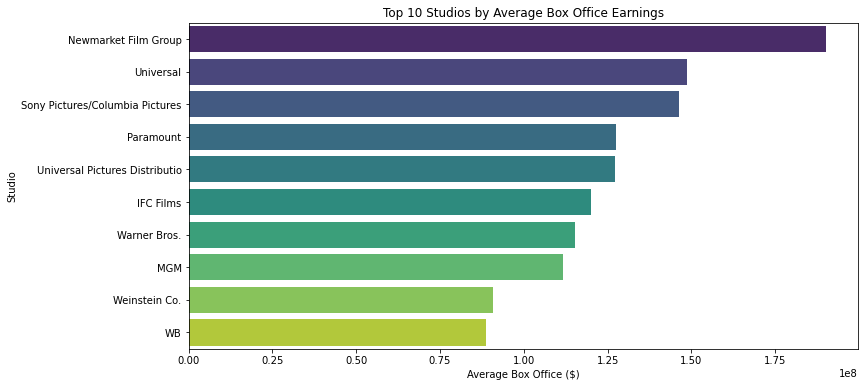
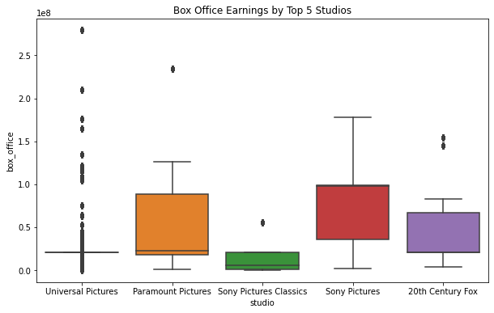
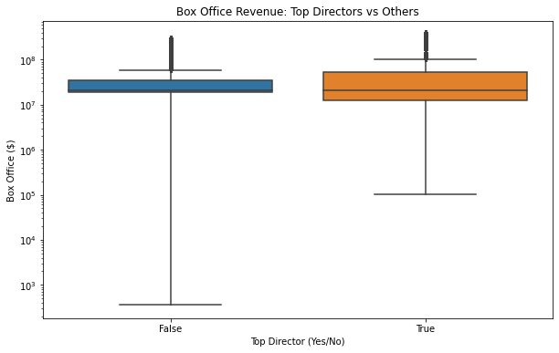
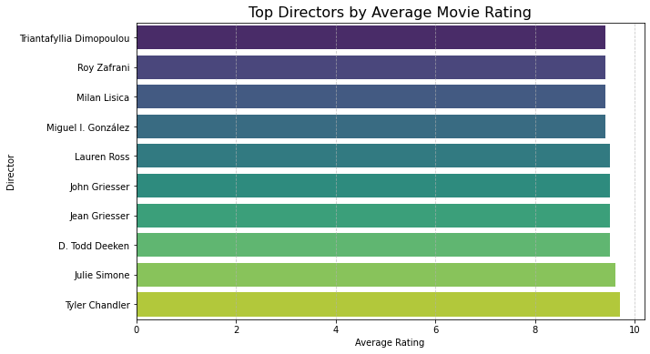
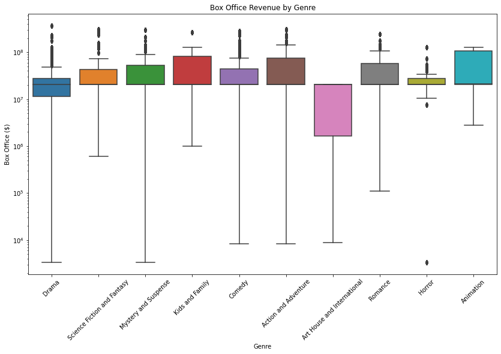

# Dsc-Phase-2-project-2025
# Final Project: Movie Performance Analysis

## Overview
This project investigates the relationships between movie reviews, box office performance, and studio output using datasets from Rotten Tomatoes, Box Office Mojo, and IMDb. The goal is to understand how critical and audience responses correlate with financial success and production trends.

## Business Understanding
The key business goal is to guide studios and investors in making informed decisions regarding movie production and marketing by analyzing factors that contribute to box office success.

### Stakeholders
- Movie studios and production houses
- Investors and financial analysts in the film industry
- Marketing teams for film promotion

### Key Business Questions
- Do highly rated movies on Rotten Tomatoes perform better at the box office?
- Which studios produce the most commercially successful films?
- What movie characteristics (e.g., genre, rating, critic score) correlate with financial performance?

## Data Understanding and Analysis

### Source of Data
- **Rotten Tomatoes Dataset:** Contains movie reviews and critic ratings.
- **Box Office Dataset:** Includes revenue data from movie releases.
- **IMDb Dataset:** Provides metadata like genre, director, cast, etc.

### Description of Data
- **Rotten Tomatoes:** Titles, critic scores, audience scores, etc.
- **Box Office:** Studio names, gross income (domestic/international), release dates.
- **IMDb:** Movie metadata including runtime, genre, and release year.

## Visualizations

1. **Studios vs Box Office Performance**  
   

2. **Rotten Tomatoes Score vs Gross Revenue**  
   

3. **Genre Distribution of Top-Grossing Films**  
   

4. **Top Directors by Average Movie Rating**
   

5. **Box Office Revenue by Genre**
  
   
## Conclusion

### Summary of Findings
- **Studio Performance:** Certain studios (e.g., Disney, Warner Bros.) consistently outperform others in box office revenue.
- **Critical Acclaim and Revenue:** Higher Rotten Tomatoes critic scores generally correlate with higher box office performance.
- **Genre Trends:** Action and adventure films dominate top-grossing lists, indicating audience preference and profitability.

These insights help stakeholders in the film industry optimize their strategies for movie development, acquisition, and marketing.

---
*This analysis was conducted using Python (pandas, matplotlib, seaborn) and is documented in the associated Jupyter notebook.*
